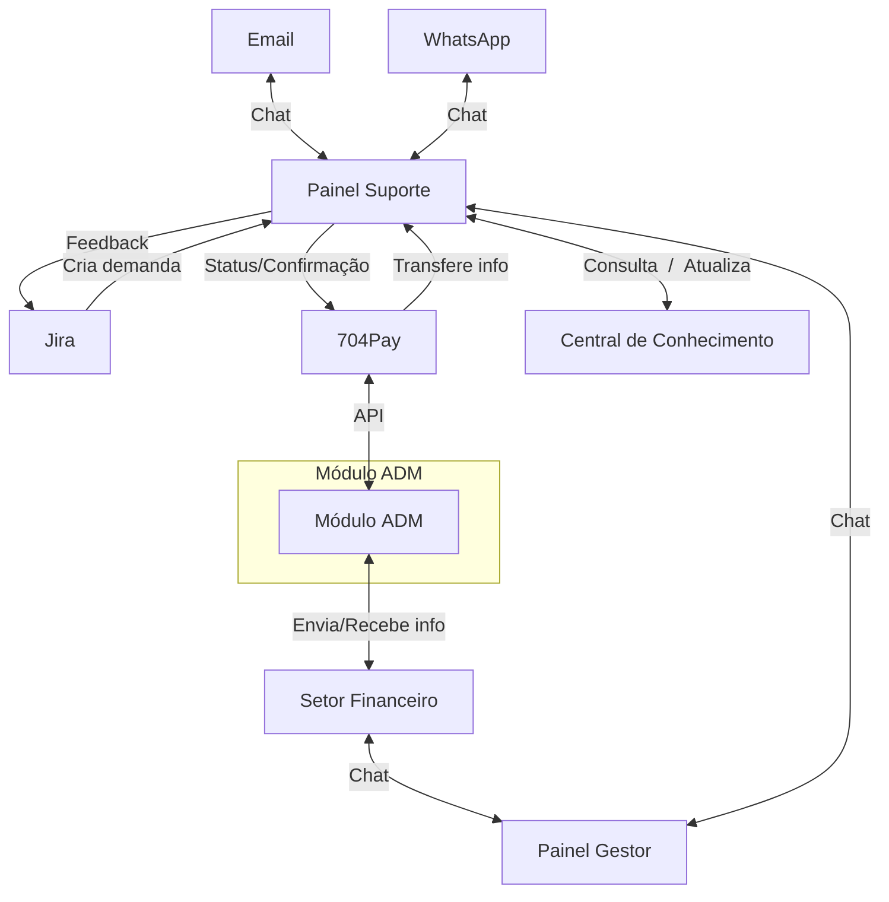

```mermaid
flowchart TD
    %% --- Fontes externas de contato -----------------------
    Email["Email"]
    WhatsApp["WhatsApp"]

    %% --- Integrações de sistemas --------------------------
    Jira["Jira"]
    Pay704["704Pay"]

    %% --- Núcleo operacional -------------------------------
    PainelGestor["Painel&nbsp;Gestor"]
    PainelSuporte["Painel&nbsp;Suporte"]
    CentralConhecimento["Central&nbsp;de&nbsp;Conhecimento"]

    %% --- Administração e Finanças -------------------------
    subgraph ModuloADMCluster["Módulo ADM"]
        ModuloADM["Módulo&nbsp;ADM"]
    end
    SetorFinanceiro["Setor&nbsp;Financeiro"]

    %% ---------- Conexões de chat --------------------------
    PainelGestor <-->|Chat| PainelSuporte
    Email        <-->|Chat| PainelSuporte
    WhatsApp     <-->|Chat| PainelSuporte
    SetorFinanceiro <-->|Chat| PainelGestor

    %% ---------- Fluxo Jira --------------------------------
    Jira -->|Cria&nbsp;demanda| PainelSuporte
    PainelSuporte -->|Feedback| Jira

    %% ---------- Fluxo 704Pay ------------------------------
    Pay704 -->|Transfere&nbsp;info| PainelSuporte
    PainelSuporte -->|Status/Confirmação| Pay704

    %% ---------- API entre 704Pay e ADM --------------------
    Pay704 <-->|API| ModuloADM

    %% ---------- ADM & Financeiro --------------------------
    ModuloADM <-->|Envia/Recebe&nbsp;info| SetorFinanceiro

    %% ---------- Base de conhecimento ----------------------
    PainelSuporte <-->|Consulta&nbsp;&nbsp;/&nbsp;&nbsp;Atualiza| CentralConhecimento

```
