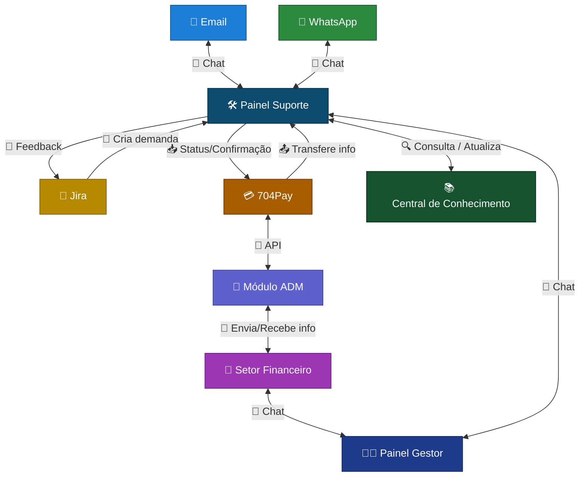

```mermaid
flowchart TD
    %% === Fontes Externas de Contato ===
    Email["📧 Email"]
    WhatsApp["💬 WhatsApp"]

    %% === Integrações de Sistemas ===
    Jira["📌 Jira"]
    Pay704["💳 704Pay"]

    %% === Núcleo Operacional ===
    PainelGestor["🧑‍💼 Painel&nbsp;Gestor"]
    PainelSuporte["🛠️ Painel&nbsp;Suporte"]
    CentralConhecimento["📚 Central&nbsp;de&nbsp;Conhecimento"]

    %% === Administração e Finanças ===
    ModuloADM["🔧 Módulo&nbsp;ADM"]
    SetorFinanceiro["💼 Setor&nbsp;Financeiro"]

    %% === Conexões de Chat ===
    PainelGestor        <-->|💬 Chat| PainelSuporte
    Email               <-->|💬 Chat| PainelSuporte
    WhatsApp            <-->|💬 Chat| PainelSuporte
    SetorFinanceiro     <-->|💬 Chat| PainelGestor

    %% === Fluxo Jira ===
    Jira                -->|📝 Cria&nbsp;demanda| PainelSuporte
    PainelSuporte       -->|📩 Feedback| Jira

    %% === Fluxo 704Pay ===
    Pay704              -->|📤 Transfere&nbsp;info| PainelSuporte
    PainelSuporte       -->|📥 Status/Confirmação| Pay704

    %% === Integração API 704Pay x ADM ===
    Pay704              <-->|🔗 API| ModuloADM

    %% === Comunicação ADM & Financeiro ===
    ModuloADM           <-->|🔄 Envia/Recebe&nbsp;info| SetorFinanceiro

    %% === Base de Conhecimento ===
    PainelSuporte       <-->|🔍 Consulta&nbsp;/&nbsp;Atualiza| CentralConhecimento

    %% --- Cores por Categoria (Tons escuros e contrastantes) ---
    style Email fill:#1c7ed6,stroke:#0b5394,stroke-width:1px,color:#fff
    style WhatsApp fill:#2b8a3e,stroke:#14532d,stroke-width:1px,color:#fff

    style Jira fill:#b68900,stroke:#7a6000,stroke-width:1px,color:#fff
    style Pay704 fill:#a85d00,stroke:#6b3700,stroke-width:1px,color:#fff

    style PainelGestor fill:#1e3a8a,stroke:#12265b,stroke-width:1px,color:#fff
    style PainelSuporte fill:#0c4a6e,stroke:#083047,stroke-width:1px,color:#fff
    style CentralConhecimento fill:#14532d,stroke:#0a2917,stroke-width:1px,color:#fff

    style ModuloADM fill:#5e60ce,stroke:#3c3f99,stroke-width:1px,color:#fff
    style SetorFinanceiro fill:#9c36b5,stroke:#6b1e84,stroke-width:1px,color:#fff

```
