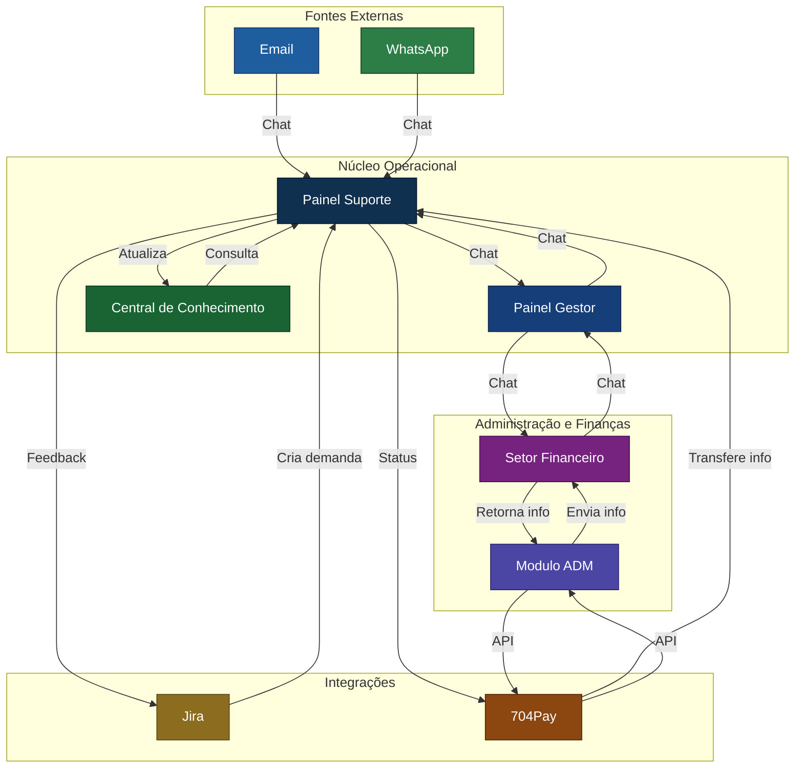

```mermaid
flowchart TD
    %% === Fontes Externas ===
    subgraph EXTERNOS[Fontes Externas]
        direction LR
        Email["Email"]
        WhatsApp["WhatsApp"]
    end

    %% === Integrações ===
    subgraph INTEGRACOES[Integrações]
        direction LR
        Jira["Jira"]
        Pay704["704Pay"]
    end

    %% === Núcleo Operacional ===
    subgraph NUCLEO["Núcleo Operacional"]
        direction LR
        PainelGestor["Painel Gestor"]
        PainelSuporte["Painel Suporte"]
        CentralConhecimento["Central de Conhecimento"]
    end

    %% === Administração ===
    subgraph ADMINISTRACAO["Administração e Finanças"]
        direction LR
        ModuloADM["Modulo ADM"]
        SetorFinanceiro["Setor Financeiro"]
    end

    %% === Fluxos Chat ===
    Email -->|Chat| PainelSuporte
    WhatsApp -->|Chat| PainelSuporte
    PainelGestor -->|Chat| PainelSuporte
    PainelSuporte -->|Chat| PainelGestor
    SetorFinanceiro -->|Chat| PainelGestor
    PainelGestor -->|Chat| SetorFinanceiro

    %% === Jira Fluxo ===
    Jira -->|Cria demanda| PainelSuporte
    PainelSuporte -->|Feedback| Jira

    %% === 704Pay Fluxo ===
    Pay704 -->|Transfere info| PainelSuporte
    PainelSuporte -->|Status| Pay704

    %% === API 704Pay <-> ADM ===
    Pay704 -->|API| ModuloADM
    ModuloADM -->|API| Pay704

    %% === ADM <-> Financeiro ===
    ModuloADM -->|Envia info| SetorFinanceiro
    SetorFinanceiro -->|Retorna info| ModuloADM

    %% === Suporte <-> Central de Conhecimento ===
    PainelSuporte -->|Atualiza| CentralConhecimento
    CentralConhecimento -->|Consulta| PainelSuporte


    %% --- Cores escuras e contrastantes ---
    style Email               fill:#1e5d9e,stroke:#123661,stroke-width:1px,color:#fff
    style WhatsApp            fill:#2d7d46,stroke:#184025,stroke-width:1px,color:#fff

    style Jira                fill:#8c6d1f,stroke:#594513,stroke-width:1px,color:#fff
    style Pay704              fill:#8c460f,stroke:#522605,stroke-width:1px,color:#fff

    style PainelGestor        fill:#163f7a,stroke:#0d2547,stroke-width:1px,color:#fff
    style PainelSuporte       fill:#0f304f,stroke:#061827,stroke-width:1px,color:#fff
    style CentralConhecimento fill:#1a6433,stroke:#0d361b,stroke-width:1px,color:#fff

    style ModuloADM           fill:#4b46a3,stroke:#27246b,stroke-width:1px,color:#fff
    style SetorFinanceiro     fill:#762380,stroke:#461453,stroke-width:1px,color:#fff


    %% --- Cores escuras e contrastantes ---
    style Email               fill:#1e5d9e,stroke:#123661,stroke-width:1px,color:#fff
    style WhatsApp            fill:#2d7d46,stroke:#184025,stroke-width:1px,color:#fff

    style Jira                fill:#8c6d1f,stroke:#594513,stroke-width:1px,color:#fff
    style Pay704              fill:#8c460f,stroke:#522605,stroke-width:1px,color:#fff

    style PainelGestor        fill:#163f7a,stroke:#0d2547,stroke-width:1px,color:#fff
    style PainelSuporte       fill:#0f304f,stroke:#061827,stroke-width:1px,color:#fff
    style CentralConhecimento fill:#1a6433,stroke:#0d361b,stroke-width:1px,color:#fff

    style ModuloADM           fill:#4b46a3,stroke:#27246b,stroke-width:1px,color:#fff
    style SetorFinanceiro     fill:#762380,stroke:#461453,stroke-width:1px,color:#fff


```
